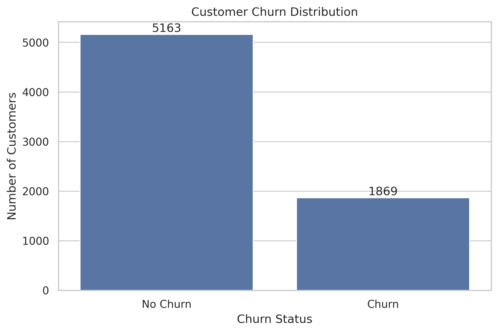
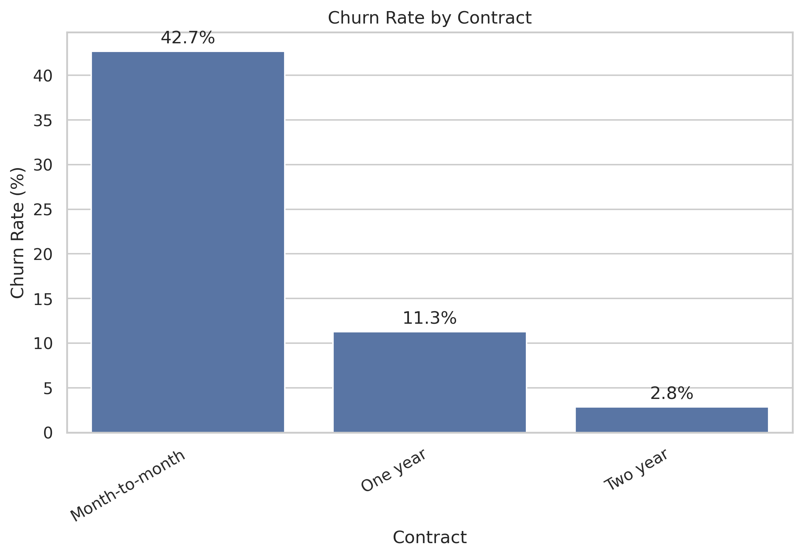
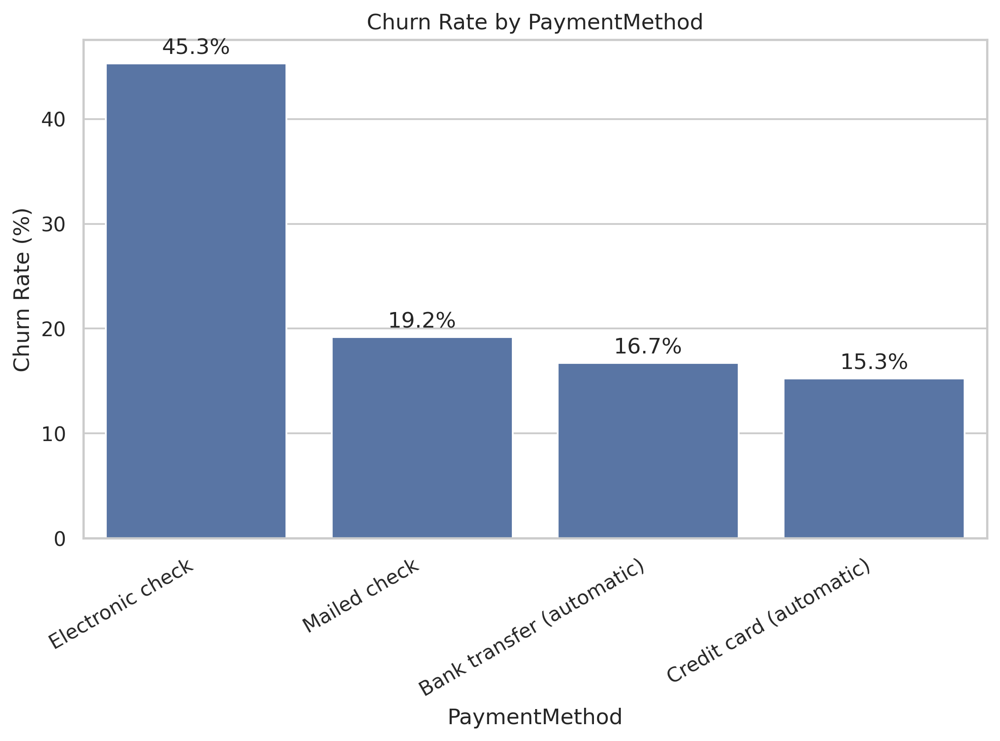
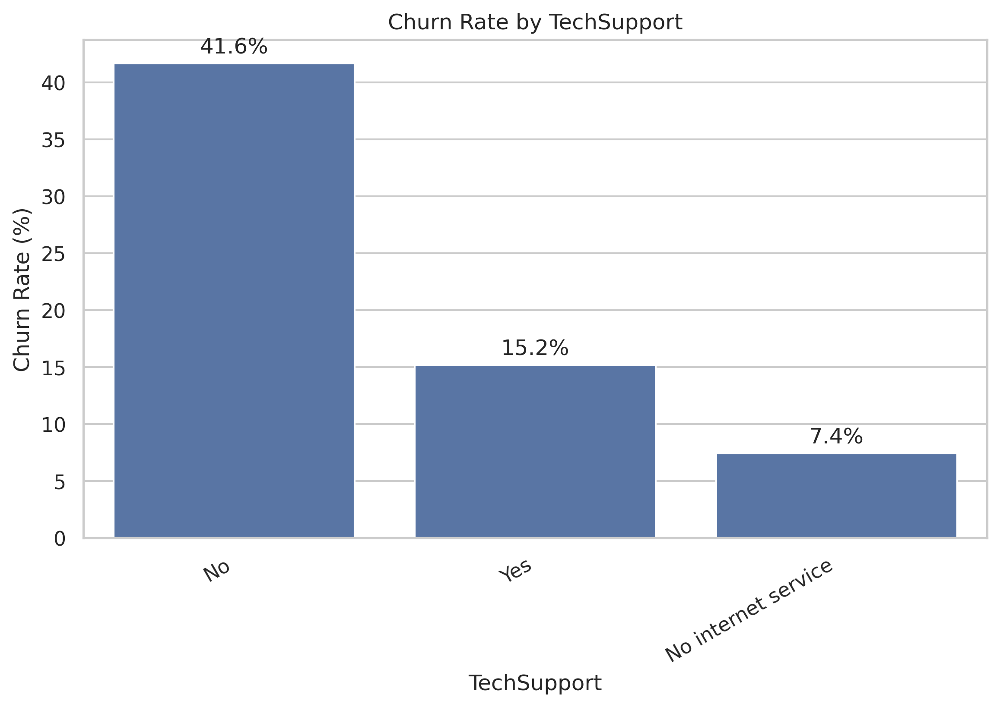
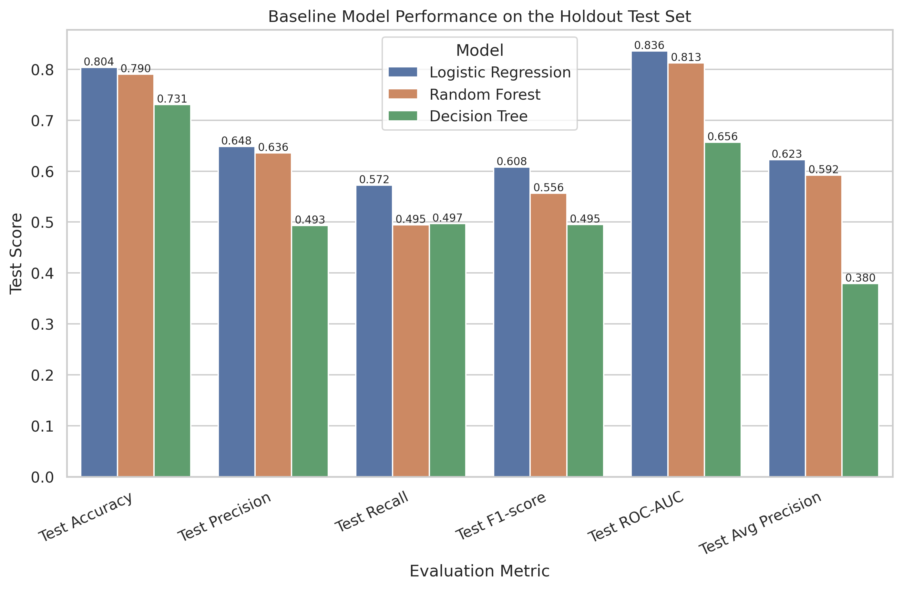
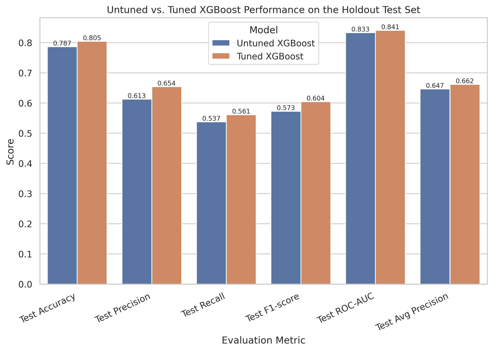
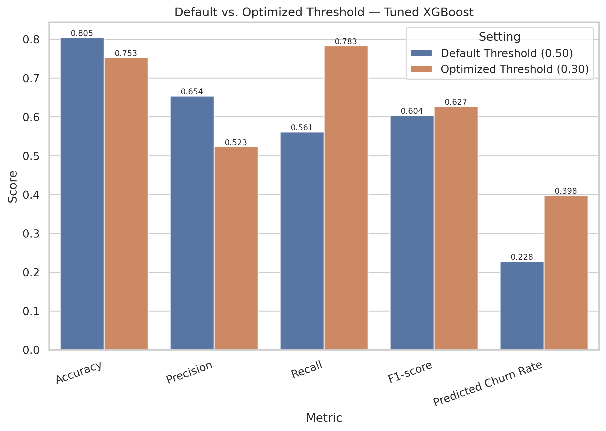
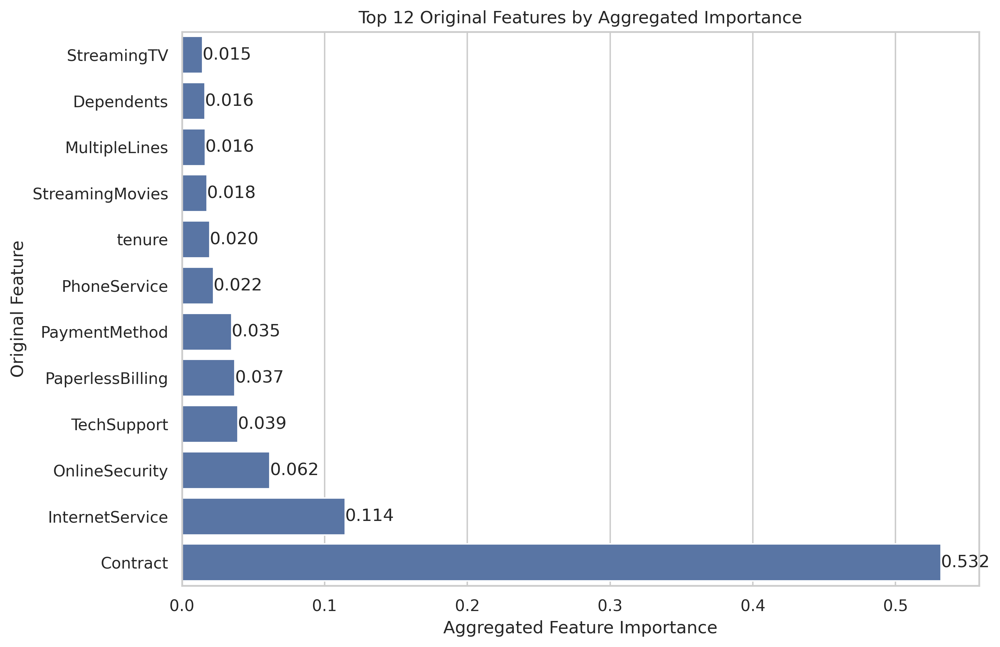
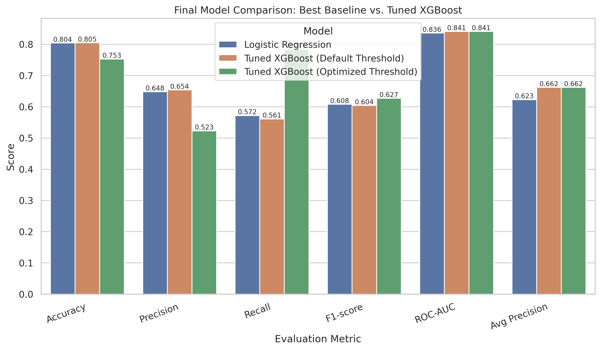

# Customer Churn Prediction with Gradient Boosting

> An end-to-end machine learning project for predicting telecom customer churn using **XGBoost**, **hyperparameter tuning**, **threshold optimization**, and **business-oriented interpretability**.

This project develops a complete churn prediction workflow on the **Telco Customer Churn** dataset, with the goal of identifying customers at risk of leaving and translating model results into actionable retention strategy.

The final solution combines:
- structured preprocessing
- exploratory data analysis
- baseline model benchmarking
- advanced gradient boosting
- hyperparameter tuning
- threshold optimization
- feature importance analysis
- business recommendations

## Business Context

Customer churn is one of the most important business problems in subscription-based industries. When customers leave, companies lose recurring revenue, increase customer acquisition pressure, and often expose underlying issues in pricing, service quality, onboarding, support, or perceived product value.

In telecom settings, churn prediction is especially valuable because it enables the company to move from **reactive customer loss management** to **proactive retention strategy**.

This project addresses the following core question:

> **Can telecom customer churn be predicted accurately enough to support targeted retention intervention?**

## Project Objective

The objective of this project is to build a machine learning system that predicts whether a telecom customer is likely to churn.

More specifically, the project aims to:

- identify the strongest factors associated with customer churn
- compare baseline and advanced machine learning models
- optimize the final model for practical churn intervention
- interpret the model in business terms
- translate the results into actionable retention recommendations

The final output is not just a classifier, but a **retention-oriented decision-support framework**.

## Dataset

**Dataset:** Telco Customer Churn  
**Source:** Kaggle  
**Target variable:** `Churn`

Each row in the dataset represents one telecom customer, while the columns describe customer attributes related to:

- demographics
- account structure
- subscribed services
- support and security features
- billing and payment behavior
- monthly and total charges

### Dataset Size
- **Original dataset:** 7,043 rows × 21 columns
- **Cleaned dataset:** 7,032 rows × 20 columns

### Data Cleaning Highlights
The preprocessing stage included:

- detection of hidden missing values in `TotalCharges`
- conversion of `TotalCharges` from text to numeric
- removal of 11 incomplete rows
- removal of the identifier column `customerID`
- binary encoding of the target variable:
  - `1` → churn
  - `0` → no churn

 ## Repository Structure

```text
customer-churn-prediction-gradient-boosting/
├── data/
│   └── WA_Fn-UseC_-Telco-Customer-Churn.csv
├── figures/
│   ├── target_distribution.png
│   ├── churn_rate_by_contract.png
│   ├── churn_rate_by_payment_method.png
│   ├── churn_rate_by_tech_support.png
│   ├── churn_rate_by_online_security.png
│   ├── baseline_model_test_comparison.png
│   ├── baseline_model_roc_curves.png
│   ├── baseline_model_pr_curves.png
│   ├── xgboost_test_comparison.png
│   ├── xgboost_untuned_vs_tuned.png
│   ├── tuned_xgboost_vs_logistic_regression.png
│   ├── threshold_tradeoff_precision_recall_f1.png
│   ├── default_vs_optimized_threshold.png
│   ├── tuned_xgboost_aggregated_feature_importance.png
│   └── final_model_comparison.png
├── notebooks/
│   └── customer-churn-prediction-gradient-boosting.ipynb
├── README.md
├── requirements.txt
└── .gitignore

---

```markdown
## Methodology

The project follows a structured applied machine learning workflow:

### 1. Data Cleaning and Preprocessing
- hidden missing-value detection
- numeric type correction
- identifier removal
- target encoding

### 2. Exploratory Data Analysis
- target imbalance inspection
- numerical distribution analysis
- churn-rate analysis across customer segments
- feature relationship review

### 3. Baseline Model Benchmarking
The following baseline models were compared:
- Logistic Regression
- Decision Tree
- Random Forest

### 4. Advanced Model Development
- XGBoost model construction
- fair comparison against the strongest baseline

### 5. Hyperparameter Tuning
- RandomizedSearchCV
- stratified 5-fold cross-validation
- ROC-AUC optimization

### 6. Threshold Optimization
- precision-recall trade-off analysis
- F1-based threshold selection
- business-oriented operating point selection

### 7. Interpretability
- transformed-feature importance
- aggregated original-feature importance
- business-driver interpretation

### 8. Business Translation
- retention segment identification
- action-oriented recommendation design

## Modeling Results

### Best Baseline — Logistic Regression
- **Accuracy:** 0.80
- **Precision:** 0.65
- **Recall:** 0.57
- **F1-score:** 0.61
- **ROC-AUC:** 0.84
- **Average Precision:** 0.62

### Tuned XGBoost — Default Threshold (0.50)
- **Accuracy:** 0.81
- **Precision:** 0.65
- **Recall:** 0.56
- **F1-score:** 0.60
- **ROC-AUC:** 0.84
- **Average Precision:** 0.66

### Tuned XGBoost — Optimized Threshold (0.30)
- **Accuracy:** 0.75
- **Precision:** 0.52
- **Recall:** 0.78
- **F1-score:** 0.63
- **ROC-AUC:** 0.84
- **Average Precision:** 0.66

## Final Model Selection

### Final Selected Model
**Tuned XGBoost with an optimized classification threshold of 0.30**

### Why this model was selected
The final model was chosen because it:

- matches the strongest baseline in standard classification performance
- outperforms the best baseline in **Average Precision**
- responds successfully to hyperparameter tuning
- becomes more effective for retention intervention after threshold optimization
- remains interpretable and business-consistent

### Practical interpretation
- **Use default probability outputs** for ranked churn-risk scoring
- **Use threshold = 0.30** for proactive churn-targeting campaigns

## Key Findings

The final model and exploratory analysis point to several strong churn-related patterns.

### Most important churn drivers
- **Contract**
- **InternetService**
- **OnlineSecurity**
- **TechSupport**
- **PaperlessBilling**
- **PaymentMethod**
- **tenure**

### Strongest transformed features
- `Contract_Month-to-month`
- `InternetService_Fiber optic`
- `OnlineSecurity_No`
- `TechSupport_No`
- `PaperlessBilling_Yes`
- `PaymentMethod_Electronic check`

### Main analytical takeaway
Customer churn in this dataset is strongly associated with:

- weak contractual commitment
- service and support gaps
- higher-risk billing/payment behavior
- early-stage customer fragility
- certain internet-service configurations

## Business Recommendations

The final model suggests several actionable retention priorities.

### 1. Prioritize month-to-month customers
Contract structure is the strongest churn-related signal in the dataset. Customers on month-to-month plans should be the first target for proactive retention action.

### 2. Investigate the fiber optic segment
Fiber optic customers show elevated churn risk despite being part of a premium service category. This may indicate pricing dissatisfaction, value mismatch, or service-quality concerns.

### 3. Use support and security services as retention levers
Customers without **OnlineSecurity** or **TechSupport** are consistently more churn-prone. These services may function as retention stabilizers.

### 4. Improve billing stability
Payment behavior, especially **electronic check**, appears strongly associated with churn risk. Encouraging more stable payment methods may reduce churn exposure.

### 5. Intervene earlier in the customer lifecycle
Short-tenure customers are especially vulnerable, suggesting that onboarding and early engagement are critical retention windows.

## Visual Highlights

### Target distribution


### Churn rate by contract


### Churn rate by payment method


### Churn rate by tech support


### Baseline model comparison


### Untuned vs tuned XGBoost


### Default vs optimized threshold


### Aggregated feature importance


### Final model comparison


## Tools and Libraries

This project was built using:

- **Python**
- **pandas**
- **NumPy**
- **Matplotlib**
- **Seaborn**
- **scikit-learn**
- **XGBoost**
- **Jupyter Notebook / Google Colab**

